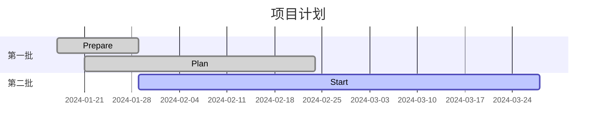

# Demo

---

## 计划

```mermaid
gantt
title 项目计划
dateFormat YYYY-MM-DD
section 第一批
Prepare :done,t13, 2024-01-17,2024-01-29
Plan    :done,t12, 2024-01-21,2024-02-24
section 第二批
Start :active, 2024-01-29,2024-03-28
```

---

## 其他内容

